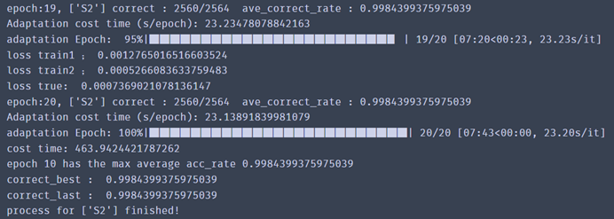
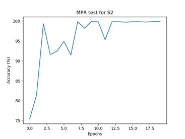
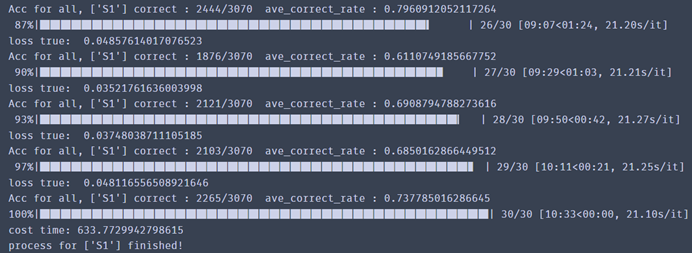
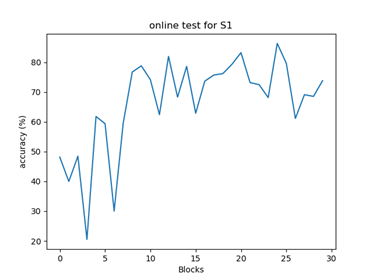

This document contains tutorial for running the codes associated with the method reported in the paper entitled “**DSDAN: Dual-Step Domain Adaptation Network Based on Bidirectional Knowledge Distillation for Cross-user Myoelectric Pattern Recognition**". 

Please refer to “<https://github.com/MYO-Electronics/DSDAN>” for the source code.
### **Abstract**

  

**Objective:** The objective of this work is to develop a robust method for myoelectric control to tackle the performance degradation caused by user variance in cross-user scenarios. 

**Methods:** In the proposed method, a preprocessing approach was first performed to convert surface electromyogram (sEMG) signals into a series of feature images. Then, the testing images were input to a teacher-student model along with training images. A bidirectional knowledge distillation technique was subsequently adopted to facilitate mutual learning between teacher network and student network to address the problem of balancing adaptation speed and accuracy in the unsupervised domain adaptation (UDA). Specially, a novel dual-step domain adaptation updating strategy was utilized to mitigate knowledge obsolescence and error accumulation problems in knowledge distillation. We evaluated the performance of our proposed framework on both high-density and low-density sEMG datasets.

**Results:** Our method achieved 98.96±4.91% and 98.09±1.86% recognition accuracies in cross-user scenarios on high-density and low-density sEMG datasets, respectively, outperforming other mainstream UDA algorithms (p<0.01). 

**Conclusion:** This study demonstrated the effectiveness and robustness of our proposed framework in a cross-user MPR task.

**Significance:** The proposed method is a practical solution to the problem of cross-user usability of robust myoelectric control in the fields of prosthetic control, robot control, and gesture interface.
### **License**
The repository is released under the MIT License.
### **Installing dependencies**
The code is developed based on the pytorch framwork.

- pytorch (version: 1.2.0): pytorch installation instructions are available at <https://pytorch.org/>

### **Demonstration with an exemplary dataset**
This is a demo when running our codes on both high-density and low-density sEMG exemplary datasets, which can also be publicly downloaded via the same link as the source codes. Here are step-by-step instructions from downloading both the source codes and the data to result display: 
#### **Preparation**
- Download the data folder, this folder contains both HD-sEMG data and low-density sEMG data collected from 6 subjects.
- Download the code files. 

For more details, you can refer to the source code or leave a message in the issue.
#### **Result display** 
To obtain the MPR testing results, you need to run the ‘main.py’ file. The code will print the results and output the classification accuracy curve in cross-user scenarios as follows:

To obtain the online testing results, you need to run the ‘main\_online.py’ file. The code will print the results and output the online testing classification accuracy in cross-user scenarios as follows:

